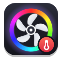
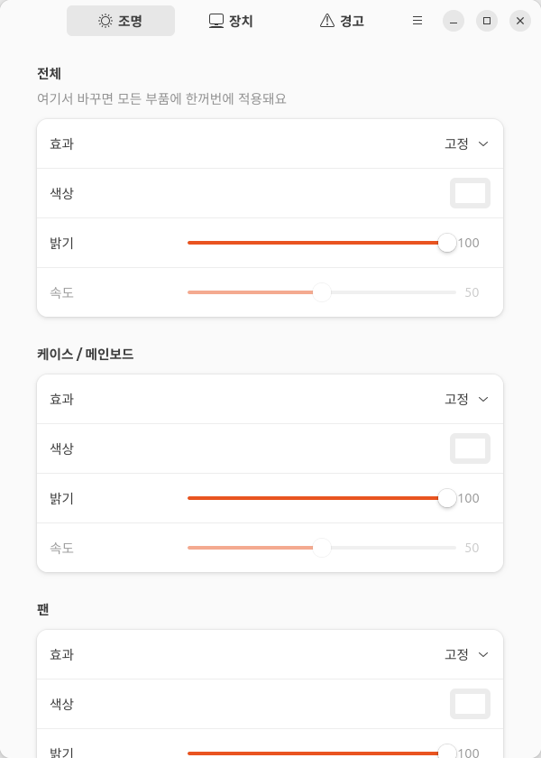
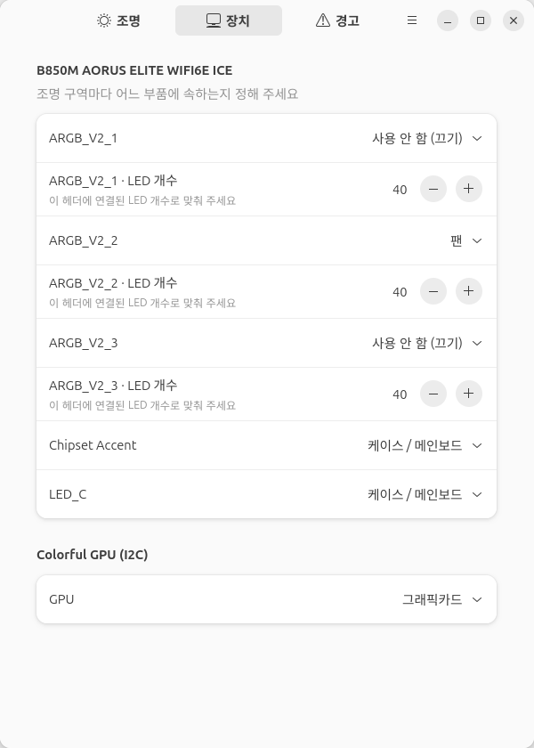
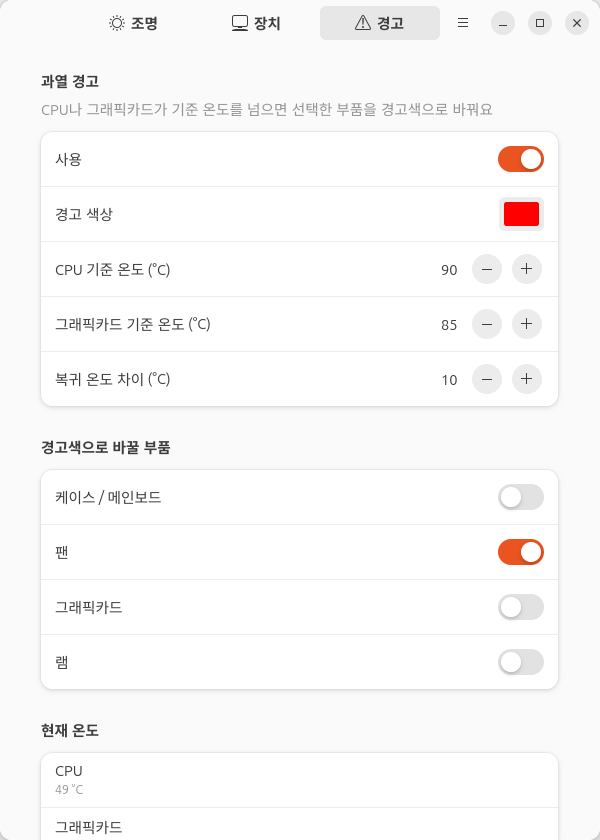

<p align="center">
  
</p>

<h1 align="center">OpenRGB Tempglow</h1>

<p align="center">
  리눅스 PC 조명을 부품별로 간단하게 설정하고, 과열되면 팬을 빨갛게 바꿔 주는 앱<br>
  <a href="README.md">English</a>
</p>

---

[OpenRGB](https://openrgb.org)는 거의 모든 RGB 컨트롤러를 다룰 수 있지만, "케이스는 흰색,
팬은 천천히 숨쉬기, 과열되면 빨강" 같은 설정을 하려면 장치·구역·프로필을 일일이 만져야 해요.
Tempglow는 OpenRGB 위에서 동작하면서 PC 조명을 네 가지 부품으로 묶어 줘요.

| 부품 | 보통 해당하는 하드웨어 |
|---|---|
| **케이스 / 메인보드** | 보드 LED, 케이스 스트립 |
| **팬** | ARGB 팬 헤더, 쿨러 |
| **그래픽카드** | 그래픽카드 조명 |
| **램** | 메모리 |

부품마다 효과(**고정**, **숨쉬기**, **무지개**, **끄기**), 색, 밝기, 속도를 따로 정하거나 한꺼번에
바꿀 수 있어요. 백그라운드 서비스가 설정을 실시간으로 적용하고 CPU·그래픽카드 온도를 지켜보다가,
기준 온도를 넘으면 선택한 부품을 경고색으로 바꾸고 식으면 원래대로 돌려놔요.

<p align="center">
  
  
  
</p>

## 요구 사항

- systemd를 쓰는 리눅스
- [OpenRGB](https://openrgb.org) **1.0 이상** (배포판 패키지, Flatpak, AppImage 모두 가능)
- Python 3.10+, PyGObject, GTK 4, libadwaita **1.5+** (Ubuntu 24.04+, Fedora 40+, Debian 13+, Arch)

## 설치

### 우분투 / 데비안 (.deb)

[최신 릴리스](https://github.com/yoobinkim541/openrgb-tempglow/releases/latest)에서
`openrgb-tempglow_*_all.deb`를 받은 뒤:

```sh
sudo apt install ./openrgb-tempglow_*_all.deb
systemctl --user start openrgb-tempglow   # 또는 로그아웃 후 다시 로그인
```

### 모든 배포판 (설치 스크립트)

```sh
git clone https://github.com/yoobinkim541/openrgb-tempglow
cd openrgb-tempglow
./install.sh            # --udev 를 붙이면 OpenRGB udev 규칙도 설치 (sudo 필요)
```

홈 폴더(`~/.local`)에만 설치돼요. 삭제는 `./install.sh --uninstall`.

### pipx

```sh
pipx install --system-site-packages openrgb-tempglow
tempglow-setup install
```

## 처음 실행할 때

1. **권한:** 장치 탭이 비어 있거나 일부 장치가 안 보이면 `tempglow-setup udev`를 실행하고
   재부팅하세요. OpenRGB 자체 udev 규칙을 설치해요.
2. **구역 지정:** **장치** 탭에서 각 조명 구역이 어느 부품인지 정해 주세요. 팬이 꽂힌 ARGB 헤더는
   보통 직접 **팬**으로 바꾸고, **LED 개수**를 실제 개수에 맞춰야 해요. 키보드·마우스 같은 주변기기는
   지정하지 않으면 건드리지 않아요.
3. **조명** 탭에서 색을, **경고** 탭에서 과열 기준을 정하면 끝이에요.

어느 헤더가 어느 팬인지 모르겠다면, 부품마다 다른 색을 줘 보고 케이스 안을 확인해 보세요.

## 문제 해결

**램이 인식되지 않아요 (AMD 보드, 특히 기가바이트).** `sudo dmesg | grep -i "ACPI.*conflict"`에
`SystemIO range ... conflicts with OpRegion ... SMBI`가 보이면 BIOS가 SMBus를 점유해서
`i2c_piix4` 드라이버가 붙지 못한 거예요. OpenRGB도 권장하는 해결책은 커널 옵션
`acpi_enforce_resources=lax`를 추가하는 거예요.

```sh
echo 'GRUB_CMDLINE_LINUX_DEFAULT="$GRUB_CMDLINE_LINUX_DEFAULT acpi_enforce_resources=lax"' \
  | sudo tee /etc/default/grub.d/99-openrgb.cfg && sudo update-grub   # 이후 재부팅
```

펌웨어와 커널이 같은 버스를 함께 쓰게 되는 옵션이니, 의미를 이해하고 켜 주세요.

자세한 명령어와 동작 방식은 [영문 README](README.md)를 참고하세요.

## 라이선스

GPL-3.0-or-later. [OpenRGB](https://gitlab.com/CalcProgrammer1/OpenRGB)와
[openrgb-python](https://github.com/jath03/openrgb-python)을 기반으로 해요.
